<h1 align="center">--- COVID-19 Tracker ---</h1>
<h1 align="center"></h1>

## :link:[ Live Website on Netlify](https://objective-lumiere-b6295b.netlify.app/)

# 

<br>

# About COVID-19 Tracker 

With the global pandemic situation it is very important to have reliable sources of information and stay up to date on the development of the disease.

COVID-19 Tracker is a website developed with that premise in mind, and it is a useful tool for anyone who needs to travel to a foreign country and needs a panorama of how this country is doing. It is also perfect for anyone who wants out of interest or curiosity to learn the stats of a specific country or even just a quick glance at the global situation.

## User Interface / User Experience (UI/UX)
#

<h1 align="center">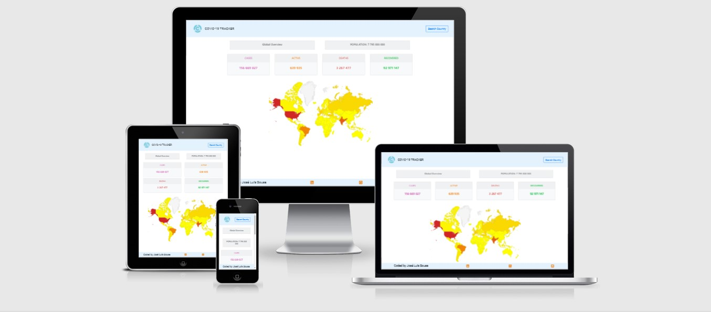</h1>
 
### Design

Most of the design elements of this project were built using [Bootstrap 5](https://getbootstrap.com/) framework, so every element looks beautiful, intuitively placed and responsive to the different screen sizes.

#### UI
COVID-19 Tracker is not meant to be a source of extensive data content, but a quick to use page that instantly gives you a general awareness of the disease's evolution by highlighting the main stats.
So the initial approach was to build a single page 'in-your-face' design with all the information clearly displaying on screen, complemented with visually rich and interactive charts.

##### UI Refactoring
During the development stage, while testing different display options I realized that in small screens the website could become somehow packed with lots of visual elements, mainly due to both the geo chart and timeline chart being displayed at the same time.
So the solution found was to move all the search content to inside a pop-up modal box that displays the interactive search results and also all the specific stats and chart for the selected country.
This makes for a much more visually appealing result while making the overall experience a lot better  for the user.

#### Wireframes
The wireframes that layed out the ground for the design were made using Adobe's [XD](https://www.adobe.com/products/xd.html), even though some aspects were changed and adapted during development.
All the views can be accessed [here](./design-files/wireframes.pdf) and checked bellow:

<h1 align="center">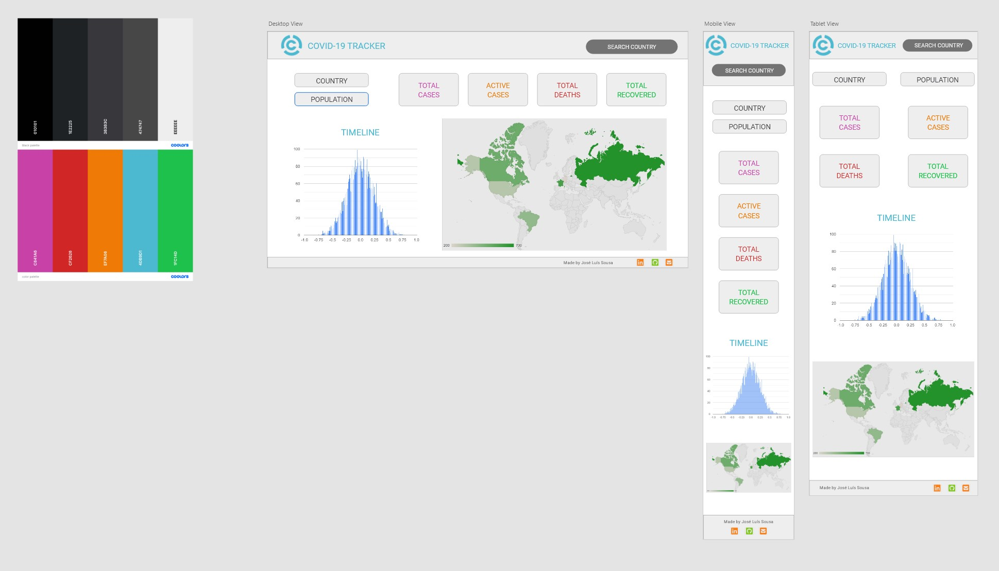</h1>

##### Mobile View
<h1 align="center">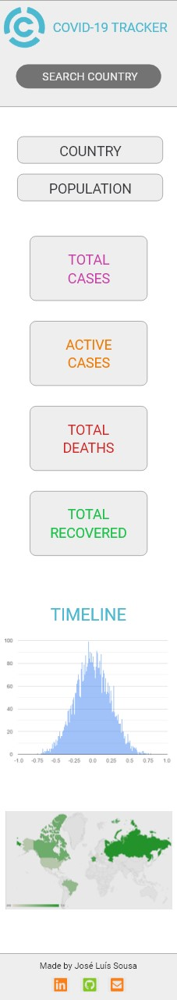</h1>

##### Tablet View
<h1 align="center">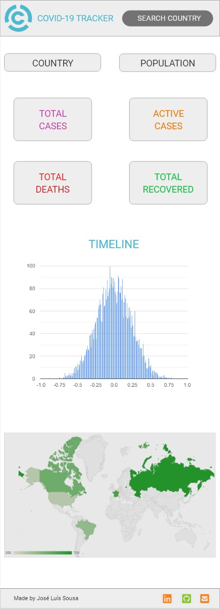</h1>

##### Desktop View
<h1 align="center">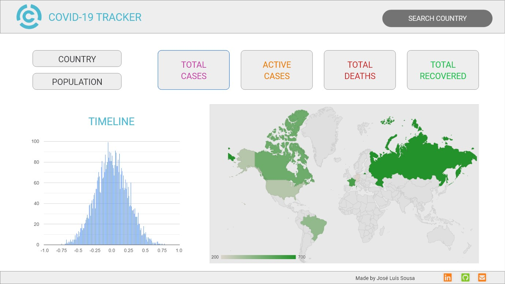</h1>

#### Style Refactoring

Whilst the initial approach was to achieve the desired result using CSS Flexbox, this was making it a bit code heavy and time consuming on the CSS side, which was not the focus of this project. So in the middle of the road all the CSS and HTML were refactored to use [Bootstrap](https://getbootstrap.com/).

#### Colours
<h1 align="center">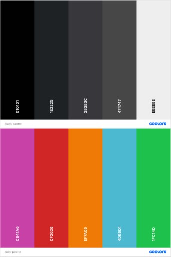</h1>

As the data presented to the user is the most important part of the project, everything containing data is presented using a combination of vivid colours, whilst the navigation and page elements use various shades of grey. 
Making sure that all these colours combined with each other as well as picking the right shade for each was achieved using [Coolors](https://coolors.co/)


During the development process I felt that something was lacking in terms of colour, so I added a very light blue (#e3f2fd) to the top navbar and footer, and this made the whole page feel more alive and pleasing to the eye.


#### Typography
<h1 align="center"></h1>

The font chosen is Google's [Roboto](https://fonts.google.com/specimen/Roboto) as it allows letters to take up as much space as it needs and ultimately, making for an improved experience for the reader while looking very good in a wide range of devices.

#### Charts
<h1 align="center">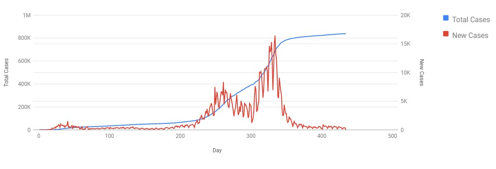</h1>

The page has a timeline chart and a geo-chart both from [Google Charts](https://developers.google.com/chart/). These are simple yet effective, with a good amount interactiveness while displaying aditional information while hovering its elements.


#### Logo
The [Logo](./assets/images/C19T-logo.png) was custom designed for this project using [Logomaker](https://www.logomaker.com/), and it transmits the idea of 'track' and 'focus' on the right piece of information.


#### Icons
To make the users' experience more pleasant and the navigation more intuitive a number of [Font Awesome](https://fontawesome.com/) icons were used.

### User Stories
<h1 align="center"></h1>


- #### As a user
    1. I want to be able to understand the purpose of the site.
    2. I want to the website to be visually pleasing.
    3. I want to the website look good no matter the device I'm using.
    4. I want to get a global overview instantly.
    5. I want to quickly have information about a specific country.
    6. I want to be able to search for any country in order to get aditional information.
    7. I want the search to be easy.
    8. I want the data to be displayed in images so I can understand it easily.
    9. I want to be able to know the pandemic evolution in a specific country. 
    10. I want to intuitively navigate through the site to browse the content.
    11. I liked the website so much that I want to know more about the developer.

## Features

This is a short description of the main features implemented in the project, and the main ones left to implement.
 
### Existing Features
- **Responsiveness** - the whole website and its components adjust to the size of the screen
- **Navbar** - allows users easily the search functionality
- **Fixed Footer** -  it's fixed at the bottom of the screen and allows users to get in touch with the developer
- **Search** - allows user to search a specific country
- **Interactive Search Results** - whenever a character is typed in the search functionality displays a list of clickable country buttons, narrowing down the list as more characters are entered.
- **Geo Chart** - a visual display with colours of the number of cases in countries around the world.
- **Geo Chart Hover** - displays the number of cases in the hovered country.
- **Timeline Chart** - a visual display of the pandemic evolution through time in the selected country.
- **Timeline Chart Hover** - displays the number of cases at that day when hovering the chart line.
- **Timeline Chart Dual Y scale** - has 2 scales on the Y axis, to better represent the impact of new cases in the case count evolution.
- **Real time information** - all the information displayed is updated when the page is loaded.
- **Custom Favicon** - the website displays a custom favicon in the browser tab 


### Features Left to Implement
- **HTTP Error Handling** - add pages and messages for the different HTTP errors.
- **Use a different API** - the chosen API isn't the most reliable (see details in the API section).
- **Add links to local COVID pages** - provide links for more in depth information of selected countries.

## API

<h1 align="center">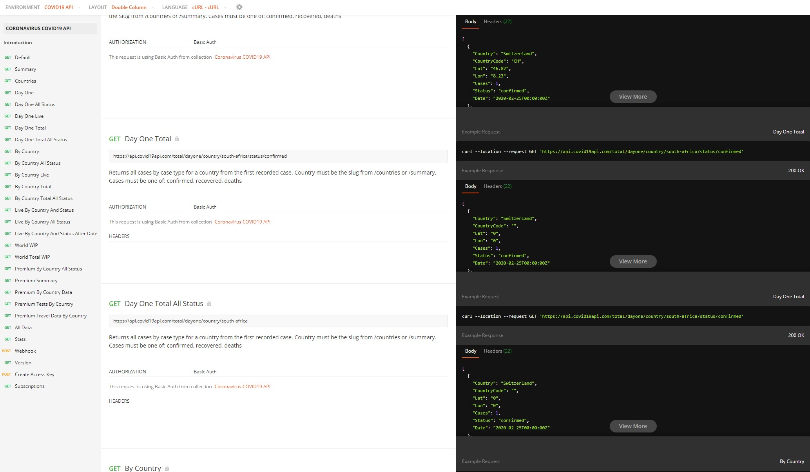</h1>

This project project uses the free version of the [Covid 19 API](https://covid19api.com/) which is a REST API that provides responses in JSON format for easy integration.
This version doesn't give access to all the data sources and is rate limited, but what it provides should be enough for the completion of this project. 

Despite that, I had a number of issues with the data retrieved, which are detailed below.

### Issue #1 - 0 Active cases in many countries

<h1 align="center">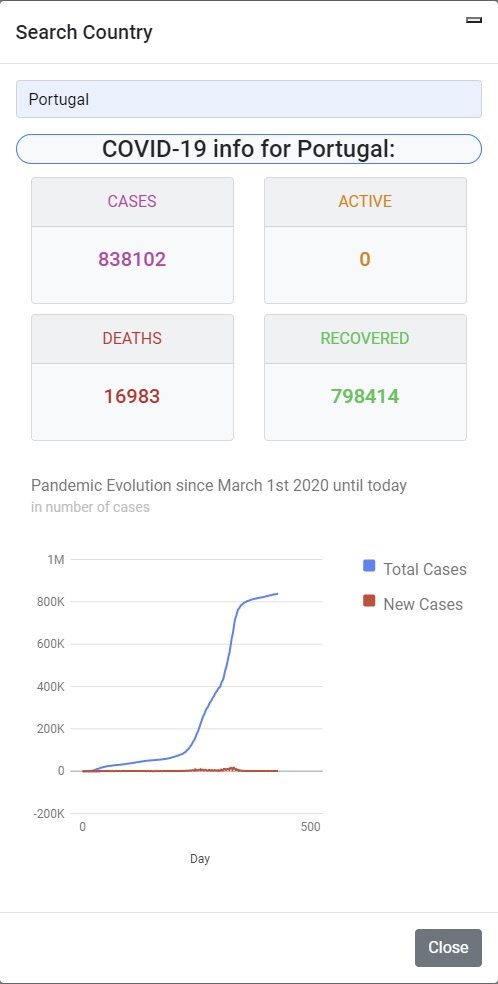</h1>

This doesn't happen all the time, but it has happened lots of times in testing, in countries that have thousands of active cases.
It could be because of the rate limitations, but it happens always in the active field and no other, and always in the same countries.

### Issue #2 - Decrease in the number of total cases in some countries

<h1 align="center">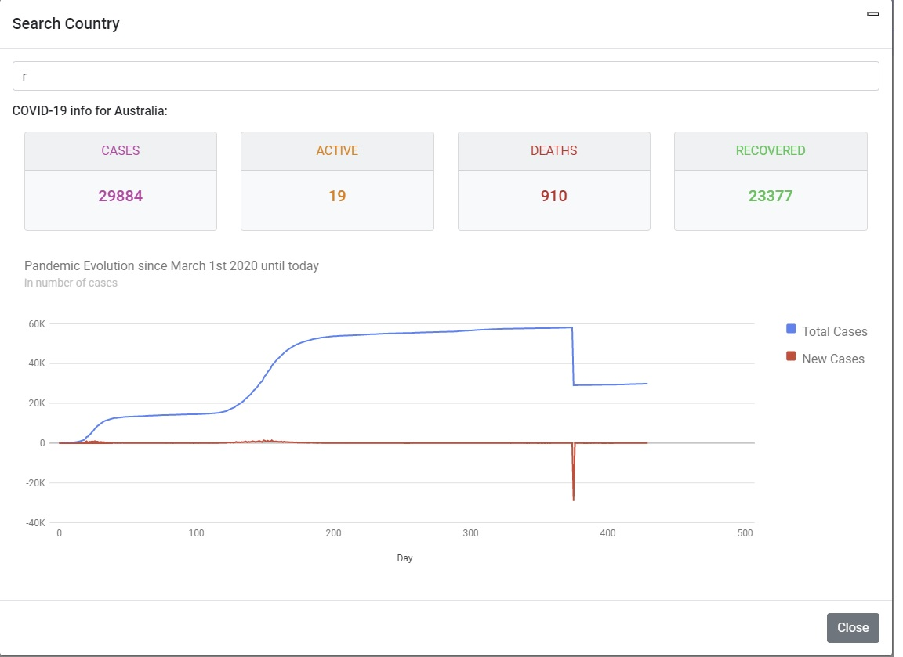</h1>

Several countries show a decrease in the total cases number, which cannot be right. This leads to a display of negative new cases in the graph, which has been addressed by not showing negative scale. The screenshot above was taken before changing the scale.


### Issue #3 - Abnormal new cases number

<h1 align="center">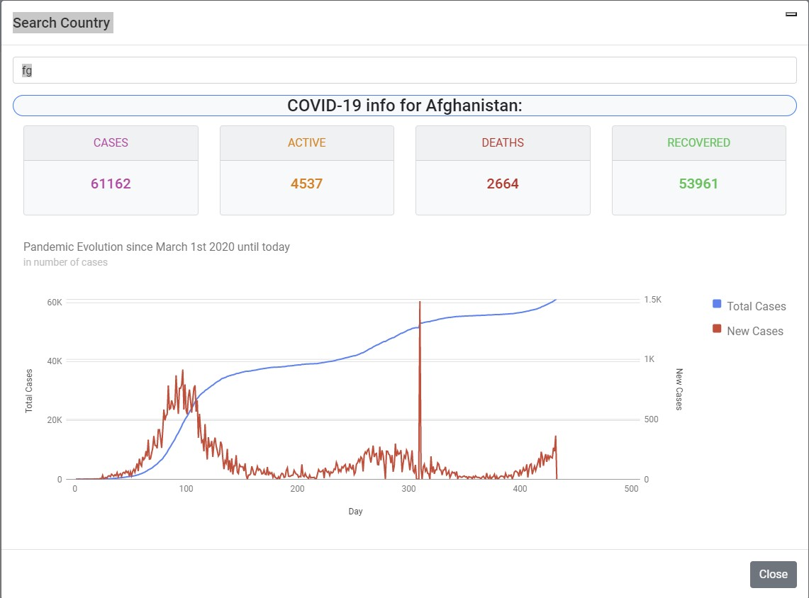</h1>

Some countries show abnormal spikes in the new cases number. There are only a few countries where this happens, and it could be coherent with the country's official data, I haven't checked that fact.

### Issue #4 - Abnormal Denmark data

<h1 align="center">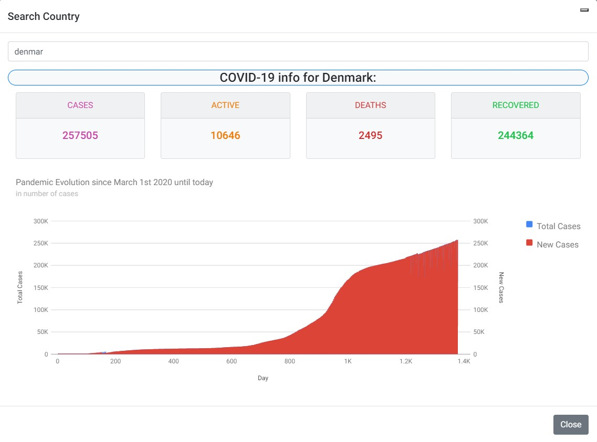</h1>

For some reason Denmark's data object in the API has at the time of the test over 1400 entries, while all others have a little under 500, one for each day starting from January 22th 2020. Until now this is the only country where this issue was found.

## Technologies Used

In this section there is a list of all the technologies used to build this project.

- [HTML](https://dev.w3.org/html5/spec-LC/) - to build the templates.
- [Javascript](https://www.javascript.com/) - as the scripting language. 
- [Jquery](https://jquery.com/) - a JavaScript library to make some manipulations and handlings easier.
- [CSS](https://www.w3.org/Style/CSS/specs.en.html) - the styling language.
- [Bootstrap 5](https://getbootstrap.com/) - CSS & JS library.
- [FontAwesome](https://fontawesom.com/) - for icons.
- [Git](https://git-scm.com/) - for version control.
- [GitHub](https://github.com) - for cloud repository storage.
- [Netlify](https://www.netlify.com/) - for deployment of production application.
- [Covid 19 API](https://covid19api.com/) - as the data source.
- [VS Code](https://code.visualstudio.com/) - IDE of choice.
- [Adobe XD](https://www.adobe.com/products/xd.html) - for wireframes.
- [Adobe Photoshop](https://www.adobe.com/products/photoshop.html) - for image manipulation.
- [Logomaker](https://www.logomaker.com/) - for logo design.
- [Coolors](https://coolors.co/) - for colour scheme.
- [Favicon Generator](https://www.favicon-generator.org/) - to generate the favicons from the logo.
- [TIDAL](https://tidal.com/) - For countless hours of streamed Hi-Fi music. Couldn't have done it without this :musical_note: :satisfied::notes:

## Testing

 This section details all the testing that was made to ensure the good performance of the website.
 
 ### User Stories testing

1. I want to be able to understand the purpose of the site.
   - The purpose is easily indentifiable by the website's branding, information displayed and the golbal map.
2. I want to the website to be visually pleasing.
   - With a minimalistic design, light colour scheme, clear separation between the elements and graphic content this website is visually pleasing.
3. I want to the website look good no matter the device I'm using.
   - Everything in the website is screen responsive, it will automatically adjust to the device I'm using.
4. I want to get a global overview instantly.
   - Landing on the website immediatly gives an overview of the global pandemic situation.
5. I want to quickly have information about a specific country.
   - If I hover with the mouse over a country, or touch it on a touch device, I get information on the total number of cases for that country.
6. I want to be able to search for any country in order to get aditional information.
   - A search functionality is implemented with an easy to find button on the top right corner of the page.
7. I want the search to be easy.
    - In the search box, just start typing the name of the country and it instantly shows the corresponding results.
8. I want the data to be displayed in images so I can understand it easily.
   - There is a geo chart and a timeline chart to provide a graphic representation of the data.
9.  I want to be able to know the pandemic evolution in a specific country. 
    - Search for the country name, click the country button, and timeline information of the pandemic evolution in the selected country is displayed.
10. I want to intuitively navigate through the site to browse the content.
    - The search, country select and close buttons are easy to find and exactly where you expect them to be.
11. I liked the website so much that I want to know more about the developer.
    - The developer's contacts are linked in the icons on the page footer.
 
### Manual Testing

The following tests were performed to the code:

1. **Elements display and responsiveness**
   1. Tested on desktop @1080p resolution
   2. Tested on desktop @1440p resolution
   3. Tested on tablet
   4. Tested on smartphone
        - Overview cards text adjusted with paddings for all devices
        - Footer text adjusted with paddings for smaller devices
        - Timeline chart's legend removed for better display on smaller devices
        - Swapped display line colours of new cases and total cases in timeline chart for better visualization on all devices, with bigger impact on smaller ones
2. **Browser testing**
   1. Tested on Google Chrome Desktop
   2. Tested on Microsoft Edge Desktop
   3. Tested on Firefox Desktop
   4. Tested on Google Chrome Mobile
   5. Tested on Firefox Mobile
       - Further browser testing needed
3. **Links, buttons and inputs**
   1. Tested search country button
   2. Tested search country input
   3. Tested country select button
   4. Tested modal close icon button
   5. Tested modal close button
   6. Tested footer link buttons
        - Modal close icon not displaying correctly, as described in known issues section
4. **Functionality**
   1. Tested API data display in global informations cards
   2. Tested geo chart hover
   3. Tested search results display while typing characters
        - Sometimes results don't display due to an HTTP 429 error, as described in known issues section
   4. Tested selecting country in search
   5. Tested API data display in selected country
   6. Tested timeline chart hover
   7. Tested a new search after a country is selected
        - Some issues related to data were found, as described in the API section

### Code testing

#### JavaScript JSHint validation

Result: No errors. Got undefined variable warnings because of jQuery and Google Charts, and unused variable warnings for functions that are being used.

<h1 align="center">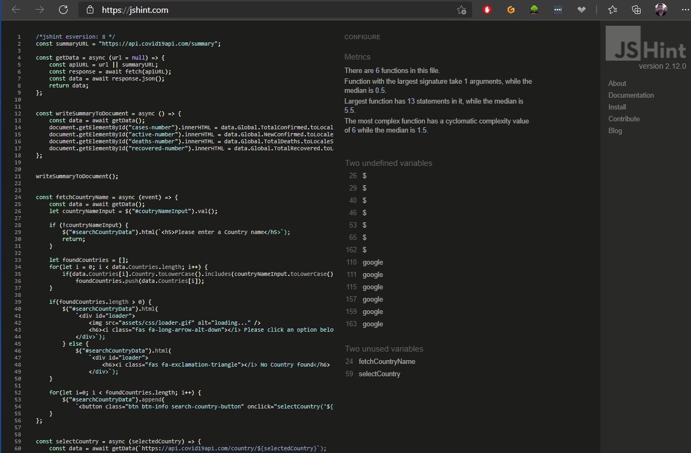</h1>
<h1 align="center">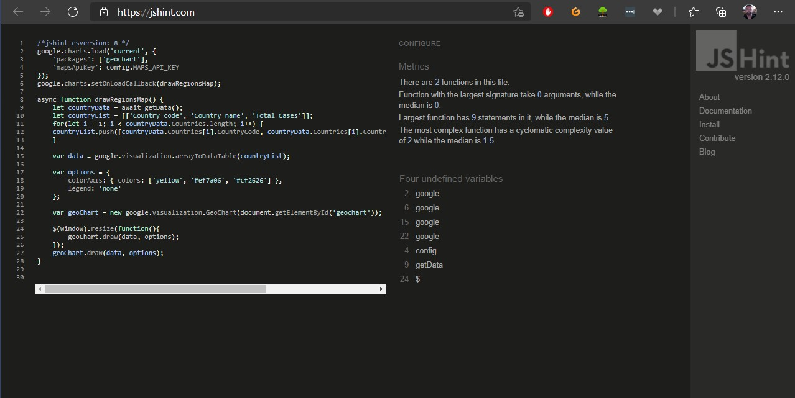</h1>

#### HTML W3C validation

Result: No errors found.

<h1 align="center">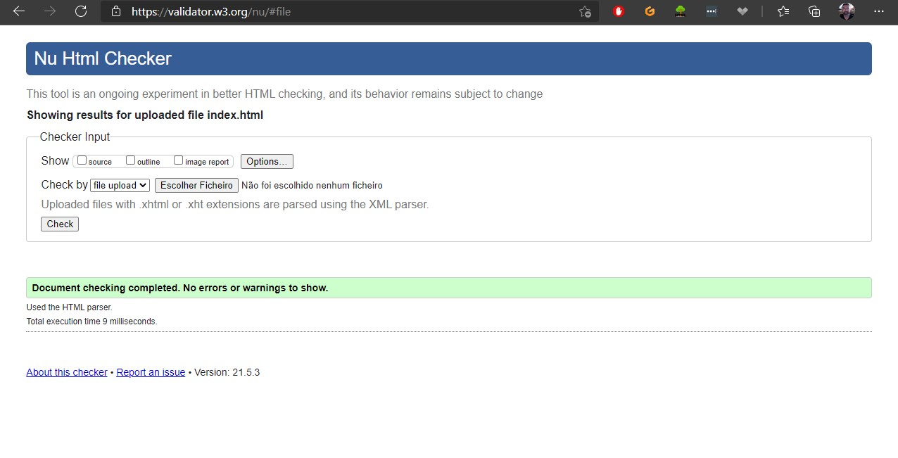</h1>

#### CSS W3C validation

Result: No errors found.

<h1 align="center">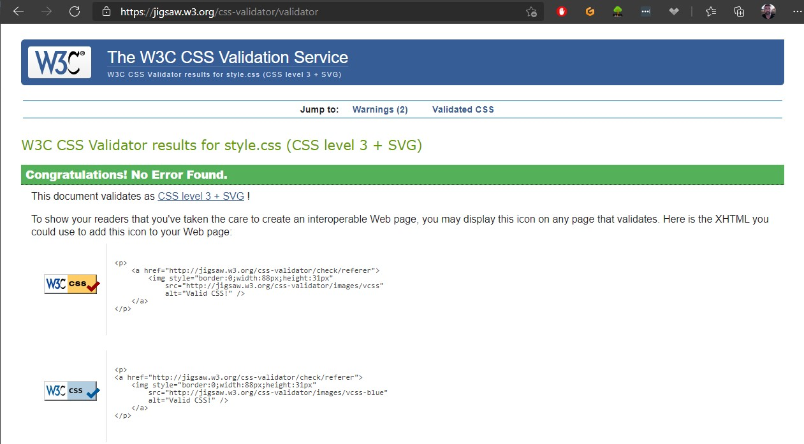</h1>

### Lighthouse Performance testing

Result: The performance rating was 93 in local deployment testing, while scoring slightly lower in the Netlify deployment.

<h1 align="center">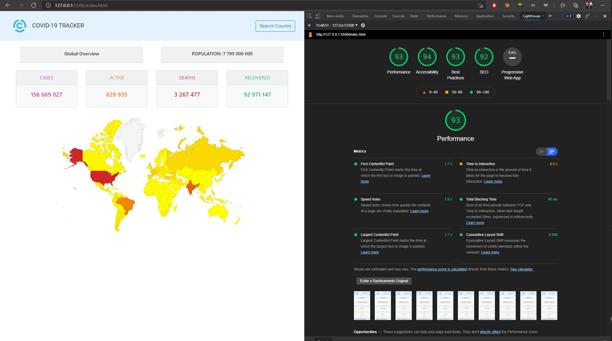</h1>
<h1 align="center">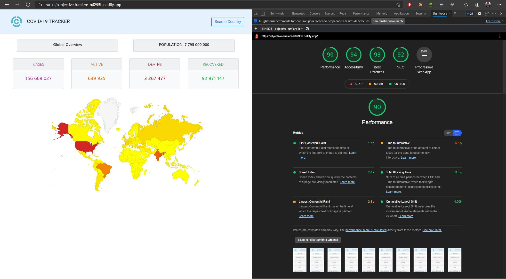</h1>

### Known issues

#### HTTP Error 429 (too many requests)

<h1 align="center">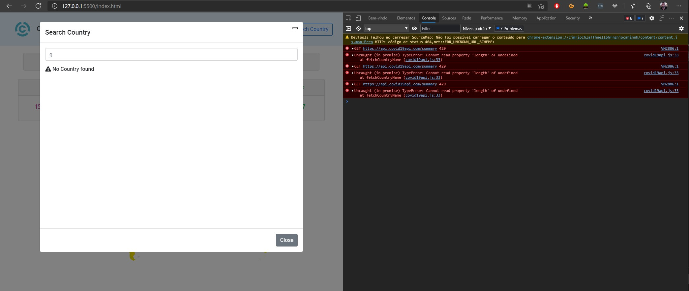</h1>

It's common, due to the API's rate limitation, to get a 429 error response. The HTTP error handling is not yet implemented, and this can lead to an unexpected behavior.

#### Modal close icon not displaying correctly

<h1 align="center">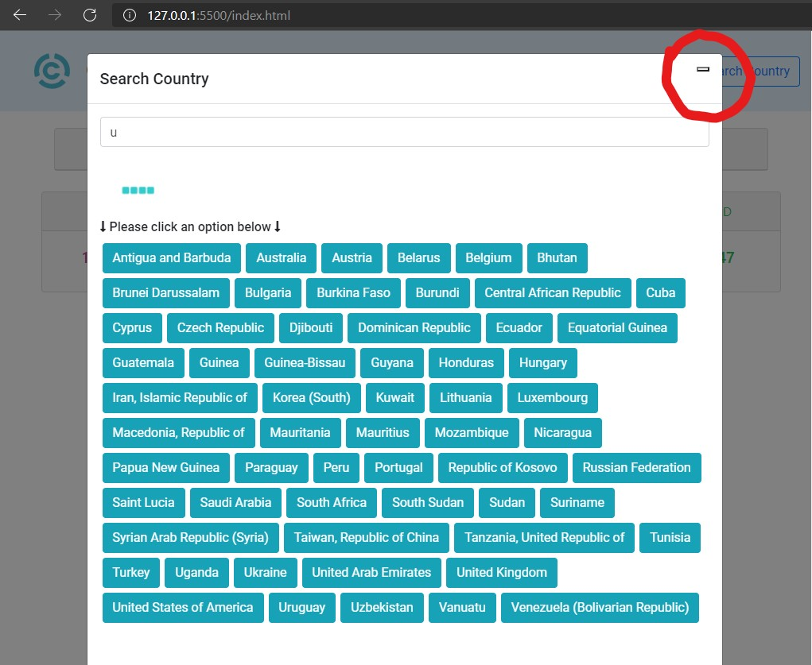</h1>

It has been this way since I pasted the raw code from Bootstrap's documentation page, and I still haven't figured out what is causing this.

#### Timeline Chart legend doesn't work on top or bottom

According to Google's documentation, this can be done by adding the following inside options:
```
legend: {position: 'top'}
```
But while left or right work fine, top and bottom have no effect at all. This is a known issue by the community.
This positioning was needed because in mobile view, with a legend, the chart display size is way too small.
So the workaround for this issue was to remove Google's legend and adding a legend image. The drawback is that legend's insteractivity was lost.

#### On touch devices, touching a country on the map returns to the top of the page.

This can be annoying in smaller devices because you have to scroll down again, but this issue isn't perceived on tablets os larger touch devices. I haven't found a solution for it yet.

## Deployment

This project was deployed locally while on development for testing purposes, and then deployed to Netlify for production mode.
Netlify was chosen instead of Github Pages because it is easier to deal with the Google Maps API key.

### Security

Google Maps' API key was stored in a config.js file not uploaded to Github. For this project to run, it needs a config.js file inside the scripts folder containing a valid key.

    const config = { 
    MAPS_API_KEY : '[YOUR_API_KEY]'
    };

This is not the ideal way to deal with this security issue, the correct way is to use Node.js, but this is outside the scope of this project, and I made sure that I cannot be charged by Google because some ill intentioned mind would misuse this key.

### Local Deployment

The website was locally deployed using VS Code's [Live Server](https://marketplace.visualstudio.com/items?itemName=ritwickdey.LiveServer) extension, following the steps below:

1. Go to Extensions tab in VS Code
2. Search for Live Server and install the extension
3. After it is installed, go back to the Explorer tab
4. Right-click on index.html file and select 'Open with Live Server'
5. The webpage will automatically open on your default web browser

### Netlifiy Deployment

Netlify deployment steps, including the ones that deal with the Maps key, are listed below:

1. Create an account and sign in to [Netlify](https://www.netlify.com/)
2. Click on the 'New Site from Git' button
3. Click on the 'Github' button and authorize Netlify to access your Github account
4. Select the repository
5. Select the master branch
6. On 'Build command' insert the following command:
```
    cd assets/scripts && echo -e "const config = {\n MAPS_API_KEY : '[YOUR_API_KEY]'\n};" > config.js
```
7. Click on the 'Deploy' button
8. After the deployment processis complete you can click the 'Preview' buton to access the deplyed website


## Credits

### Content

- The data source for this project is [Covid 19 API](https://covid19api.com/).

### Acknowledgements

- To make Google Charts and Maps responsive to window resizing I used the code in this [Flo's blog post](https://flopreynat.com/blog/2015-09-08-make-google-charts-responsive).
- [Stack Overflow](https://pt.stackoverflow.com/) was used numerous times to better understand and implement code, especially with async await Javacript functions.


### Thank yous :pray:
- The developer community in general for the willingness to help others and making an infinite ammount of content available online and the Code Institute's Slack community in particular
- The numerous and too many to mention content creators that produce valuable guides an tutorials
- My Mentor Maranatha Ilesanmi for always pointing me to the right direction
